```
version app: 6.4.1001
platform: android 
platformVersion: 9.0, 14.0 
```

# Проект по автоматизации мобильного приложения Wildberries

<br>
<p align="center">
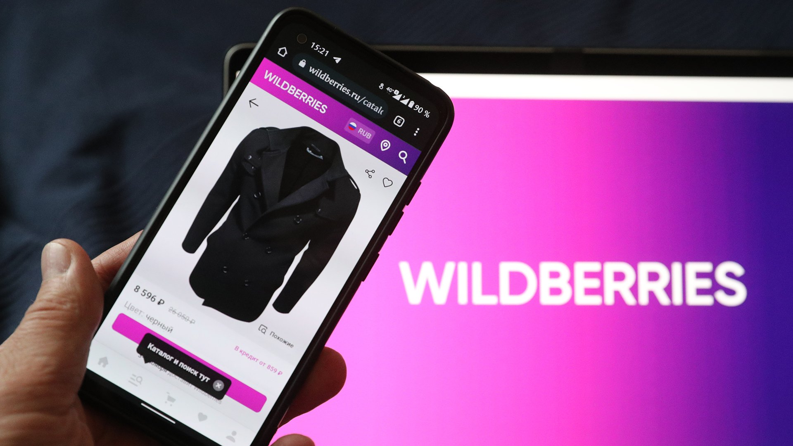
</p>
<br>

## Содержание:

- [Использованный стек технологий](#computer-использованный-стек-технологий)
- [Реализованные проверки](#computer-реализованные-проверки)
- [Запуск тестов](#running_woman-запуск-тестов)
- [Сборка в Jenkins](#-сборка-в-jenkins)
- [Пример Allure-отчета](#-пример-allure-отчета)
- [Интеграция с Allure TestOps](#-интеграция-с-allure-testops)
- [Интеграция с Jira](#-интеграция-с-Jira)
- [Уведомления в Telegram с использованием бота](#-уведомления-в-telegram-с-использованием-бота)
- [Видео примера запуска теста в Selenoid](#-видео-примера-запуска-теста-в-selenoid)

## :computer: Использованный стек технологий

<p align="center">


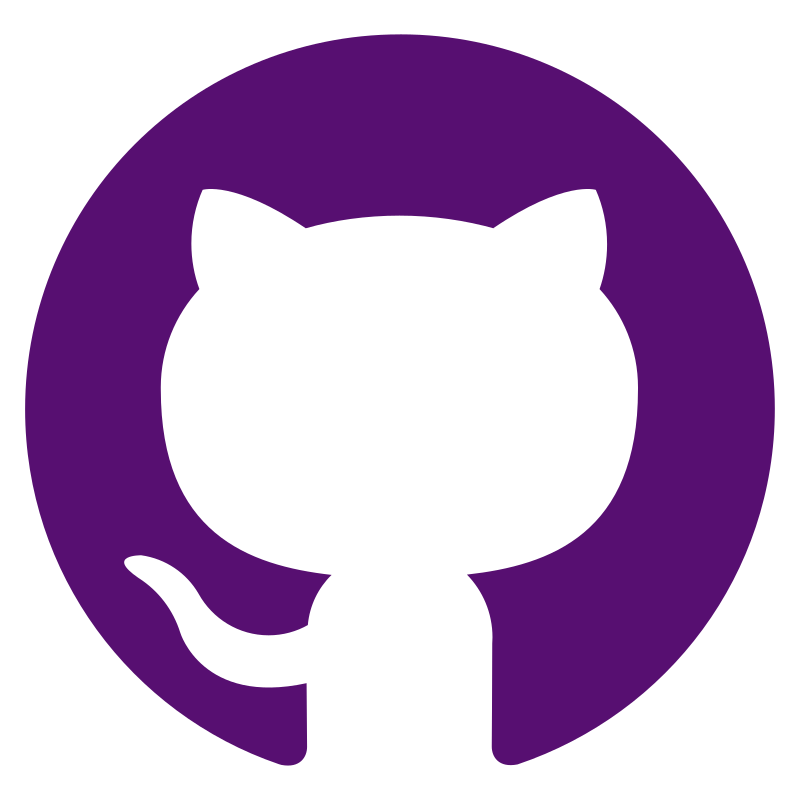


</p>

Автотесты написаны на <code>Java</code> с использованием <code>JUnit 5</code> и <code>Gradle</code>.
Для UI-тестов использован фреймворк [Selenide](https://selenide.org/), чтобы создать на локальном компьюторе эмулятор мобильного устройства с ОС Android используется [Android studio](https://selenide.org/), WebDriver-сессия устанавливается через [Appium server](https://appium.io/docs/en/2.2/).
Помимо этого в данном проекте используется [Browserstack](https://www.browserstack.com/) - облачная платформа для тестирования, которая предоставляет
возможность тестировать веб-сайты и мобильные приложения в браузерах по требованию, операционных системах и реальных мобильных устройствах.
Запуск тестов можно осуществлять локально или с помощью Browserstack.
Также реализована сборка в <code>Jenkins</code> с формированием Allure-отчета и отправкой уведомления с результатами
в <code>Telegram</code> после завершения прогона. Произведена интеграция данной сборки с <code>Allure TestOps</code>

Allure-отчет включает в себя:

* шаги выполнения тестов;
* скриншот страницы в браузере в момент окончания автотеста;
* Page Source;
* логи браузерной консоли;
* видео выполнения автотеста.

## :computer: Реализованные проверки

- [x] *Добавление товара в корзину*
- [x] *Удаление товара из корзины*
- [x] *Навигация по приложению (профиль, корзина, каталог товаров)*
- [x] *Поиcк и отображаемая карточка выбранного товара*
- [x] *Выбор товара из категорий:*
    - Женщинам
    - Новый год
    - Товары для взрослых
        - наличие Alert сообшения, для подтверждения возрастной категории
- [x] *Проверка наличия предупреждаюего сообщения на некорректно введённый номер телефона при входе в личный кабинет*
- [x] *Наличие модального окна для ввода кода верификации при входе в личный кабинет*
- [x] *Поиск товара через строку поиска*

## :running_woman: Запуск тестов

### Локальный запуск тестов

```
gradle clean test "-DdeviceHost=local"
```

### Запуск тестов через Browserstack

```
gradle clean test "-DdeviceHost=browserstack"
```

##  <a href="https://jenkins.autotests.cloud/job/Mobile_WB_app/"> Сборка в Jenkins</a>

<p align="center">
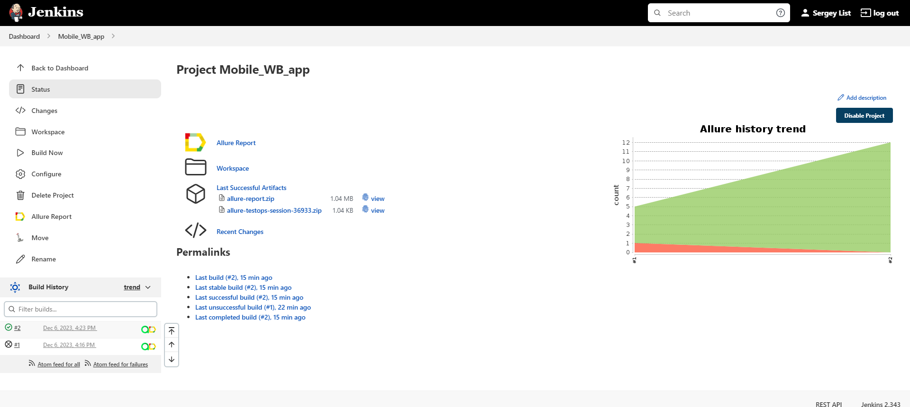
</p>

##  <a href="https://jenkins.autotests.cloud/job/Mobile_WB_app/2/allure/">Пример Allure-отчета</a>

### Overview

<p align="center">
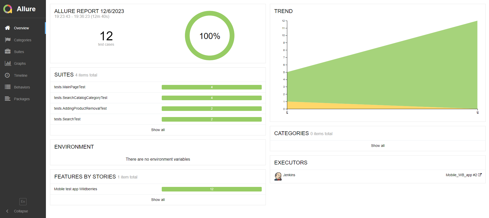
</p>

### Результат выполнения теста

<p align="center">
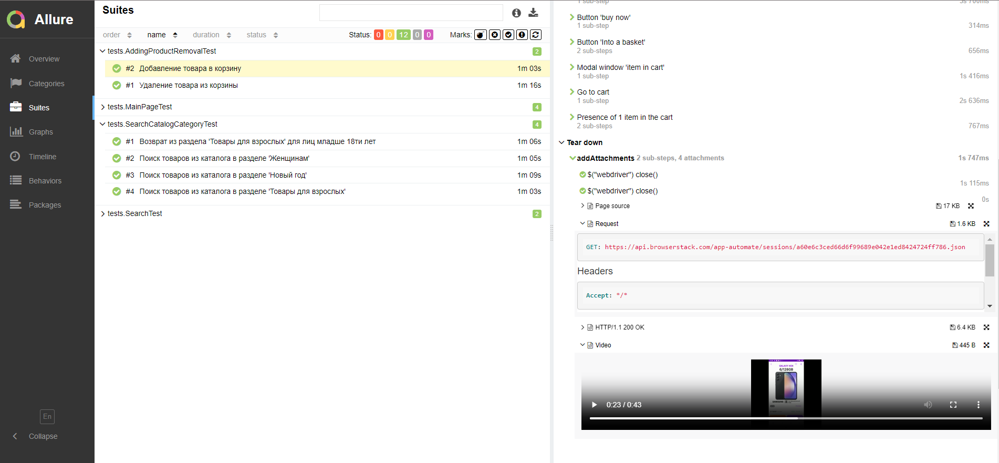
</p>
<p align="center">
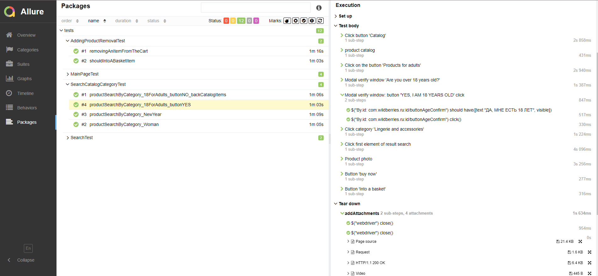
</p>

##  Интеграция с [Allure TestOps](https://qameta.io/)

### Основной дашборд

<p align="center">
  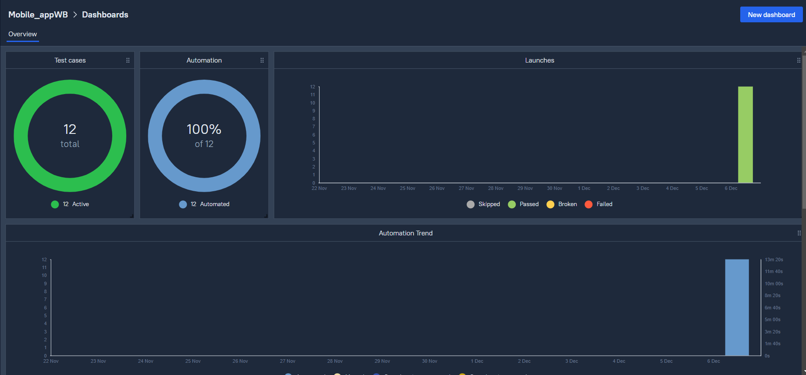
</p>

### Тест-кейсы

<p align="center">
  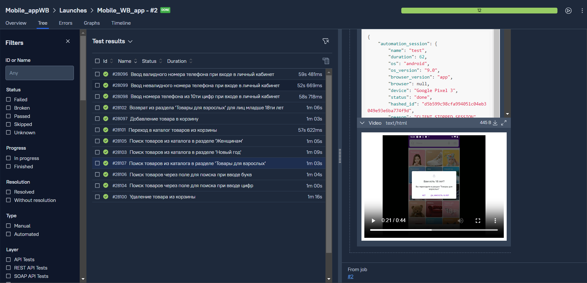
</p>
<p align="center">
  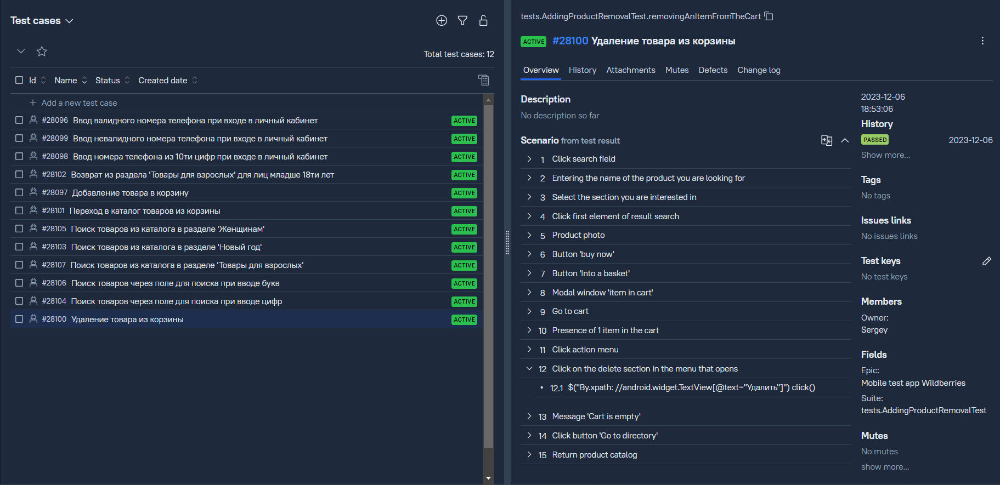
</p>

###  Уведомление в Telegram с отчетом о прогоне данной сборки

<p align="center">
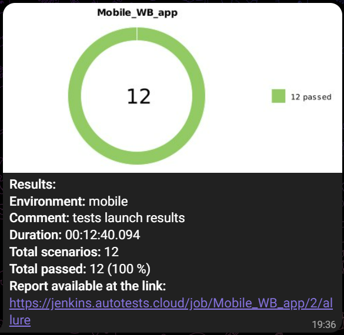
</p>

##  Интеграция с [Jira](https://www.atlassian.com/ru/software/jira)

<p align="center">
  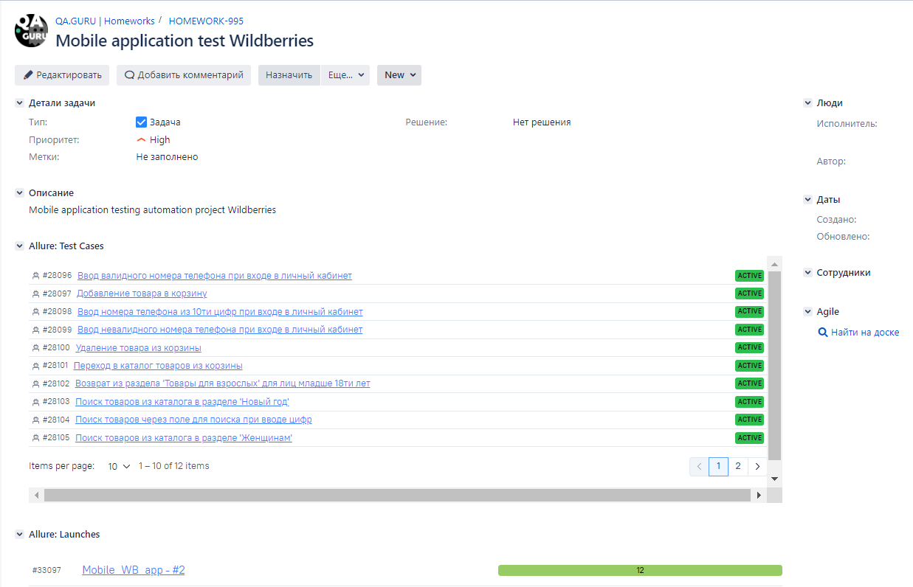
</p>

###  Видео примера запуска теста на облачной платформе Browserstack

К каждому тесту в отчете прилагается видео. Одно из таких видео представлено ниже AddingProductRemovalTest > Добавление
товара в корзину.
<p align="center">
  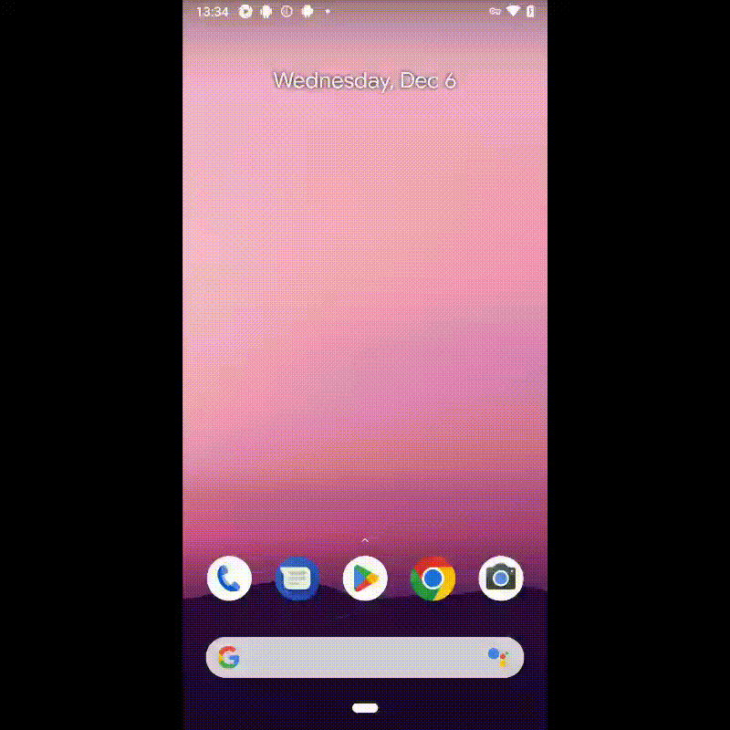
</p>